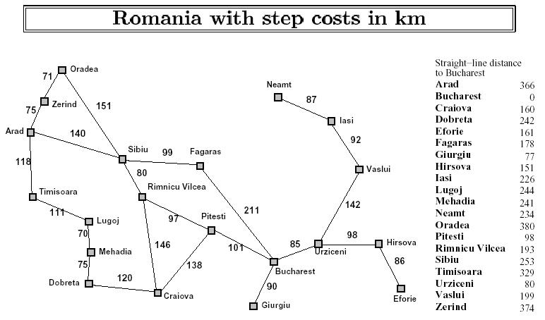

# Search Algorithms in AI
In this project I implement most of the classical search algorithms using in AI
To use these search algorithms for solving your problem, you should define your problem and it's state classes that extends from Problem and State class.

Use `MyProblem extends Problem` and `MyProblemState extends State` to achieve that.

For example, I model a navigation problem in Romania by defining NavigationProblem and NavState classes. You can see the map of the cities below:

  
 You can also see the CityIDs below:
 
 0. Arad
 1. Zerind
 2. Oradea
 3. Sibia
 4. Timisoara
 5. Lugoj
 6. Mehadia
 7. Dobreta
 8. Craiova
 9. Rimnicu Vilcea
 10. Pitesti
 11. Fagaras
 12. Bucharest
 13. Giurgiu
 14. Urziceni
 15. Hirsova
 16. Eforie
 17. Vaslui
 18. Iasi
 19. Neamt